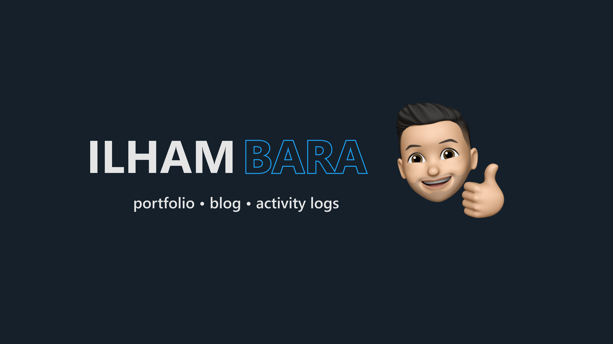

# nextjs-portfolio

Getting started to Next.js for my portfolio.



---

## Run Locally

Install dependencies

```bash
  npm install
```

Start the development server

```bash
  npm run dev
```

Open http://localhost:3000 with your browser to see the result.

## Features

- Dark mode only
- Responsive design
- No more convoluted menus
- Animated memoji

## Tech Stack

**Client:** Next js, Chakra UI, Forem DEV, and Framer-motion

**Server:** Node and Vercel
